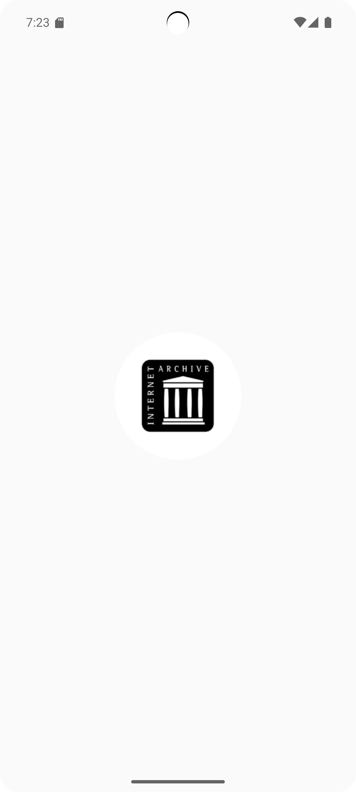
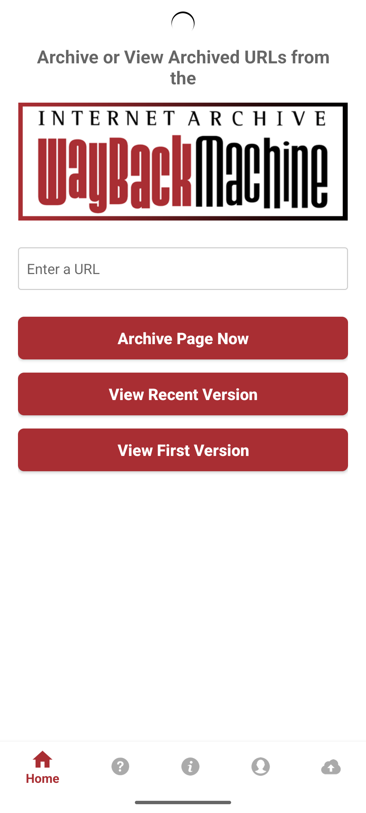
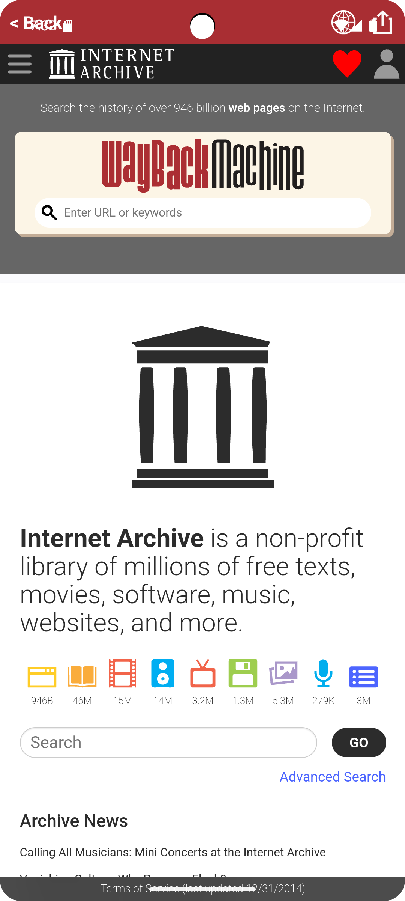
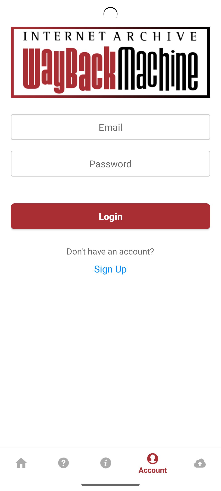
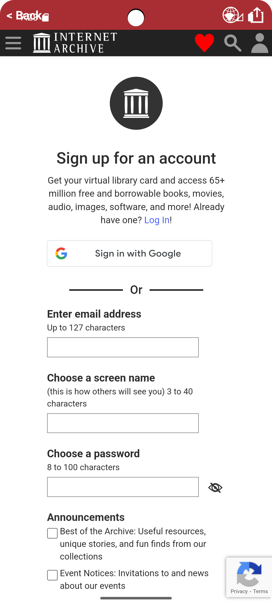
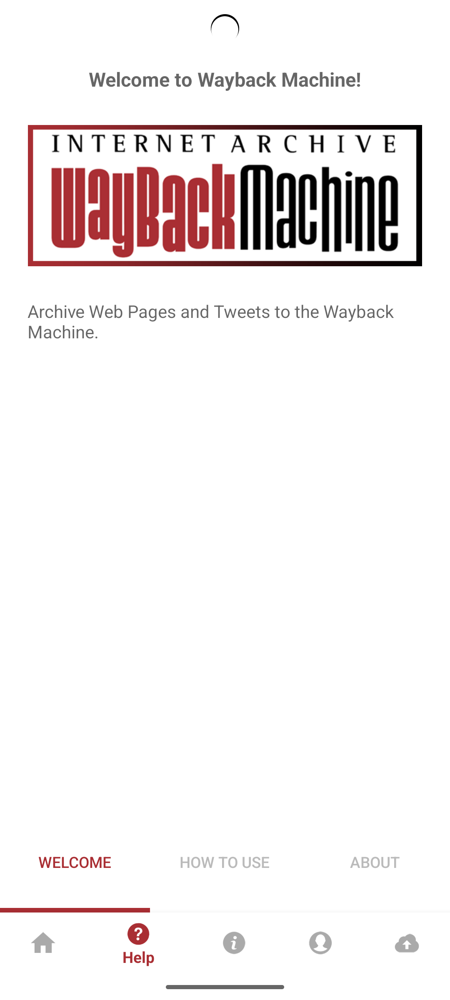
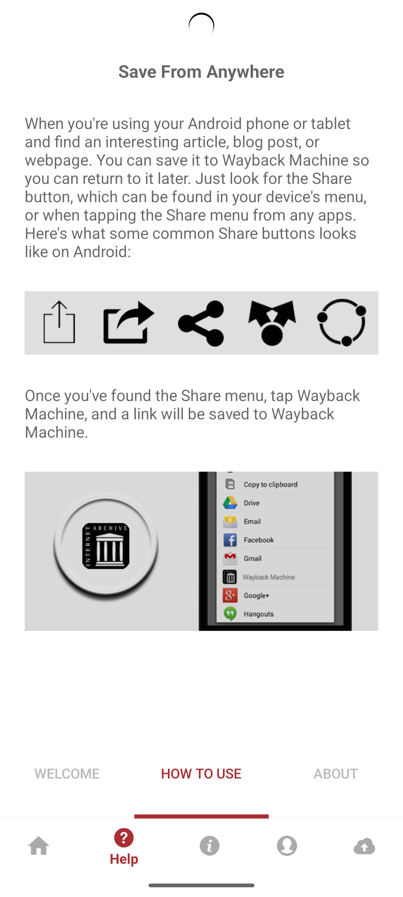
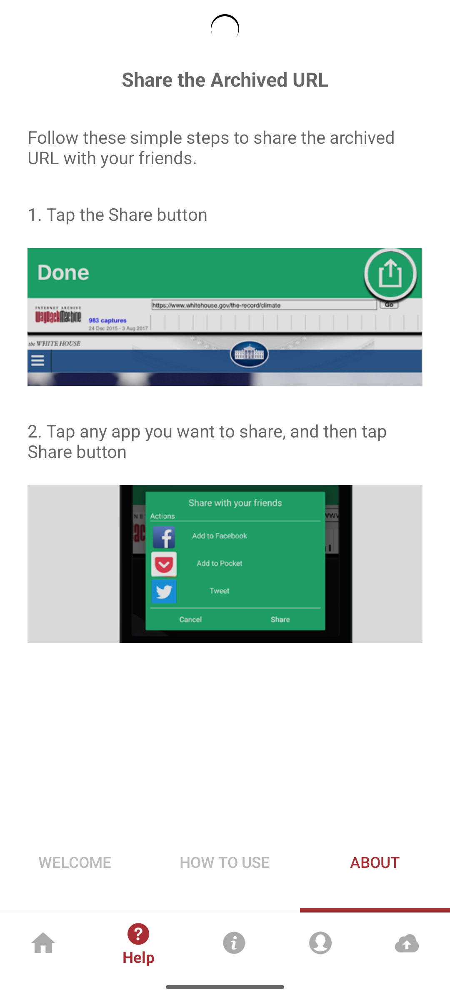
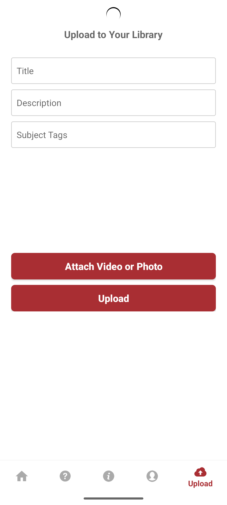

# Wayback Machine Android App

The Wayback Machine Android App is a mobile application that allows users to access the Internet Archive's Wayback Machine directly from their Android devices.

## Screenshots

  ### Splash screen
  
  
  ### Home screen
  

  ### Feed screen
  
  
  ### Login screen
  
  
  ### Registration screen
  
  
  ### Quick guides (1-3)
  
  
  

  ### Upload screen
  

## Features

- **Archive web pages** using the Wayback Machine
- **View recent and first versions** of websites
- **User Authentication** with login/signup options
- **Real file uploads** to your Internet Archive library
  - Upload images and videos directly to archive.org
  - Automatic metadata tagging and organization
  - Professional upload progress indicators
- **Enhanced User Experience**
  - Smooth animations and loading states
  - Intuitive file selection and management
  - Comprehensive error handling and user feedback
- **Production-ready** with optimized performance and clean code

## Setup Instructions

To set up the Wayback Machine Android App on your machine, follow these steps:

### Prerequisites

- Android Studio installed on your computer
- Android device or emulator for testing

### Installation

1. Clone the repository to your local machine using Git or download the ZIP file and extract it.

2. Launch Android Studio.

3. Click on "Open an existing Android Studio project" or select "File" > "Open" from the menu.

4. Navigate to the cloned/downloaded project directory and select it.

5. Android Studio will import the project and download any required dependencies.

6. Click on "Sync Project with Gradle Files" to synchronize the project with the Gradle build files.

7. Once the synchronization is complete, click on "Build" > "Build Project" to build the Wayback Machine Android App.

8. Connect your Android device to your computer using a USB cable, or set up an emulator.

9. Ensure that your Android device is in developer mode and USB debugging is enabled. Refer to the official Android documentation for instructions specific to your device.

10. In Android Studio, click on the "Run" button or select "Run" > "Run app" from the menu.

11. Choose your connected device or emulator from the list of available devices.

12. Android Studio will install the Wayback Machine Android App on your device and launch it.

13. You're now ready to explore the archived web pages using the Wayback Machine!

## Contribution

Contributions to the Wayback Machine Android App are welcome! If you encounter any issues, have suggestions for improvements, or would like to contribute new features, please create an issue or submit a pull request to the project's repository.

## Contact

If you have any questions, suggestions, or feedback, you can reach out to the project maintainer at [info@archive.org](mailto:info@archive.org).
